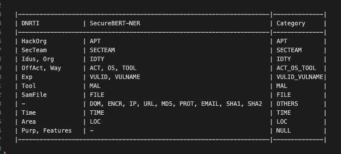

# General explanation of each of the assignments

**1. Benchmarking Analysis in the notebooks**

1. Initial data examination and statistical tests
2. Running a pre-trained model from the network without training on our data
3. Creating a Transformers pipeline to save processes as objects
4. Training two models(SecureBERT-NER & SecureBERT-CyNER) based on my transformation and train.txt and saved them
5. Evaluating mapping metrics by category and re-assessing the metrics

**2. Build an NER Service using FastAPI**

1. API Setup: You've created a FastAPI service with two endpoints: /ner/ and /cyner/ for extracting entities using different NER models.
3. Model Loading: The models (SecureBERT NER and CyNER) are dynamically loaded, allowing flexibility for updates. Each model handles tokenization, prediction, and entity extraction.
4. Dockerize: Package the FastAPI app using a Dockerfile to run it in an isolated environment. Ensure all dependencies and models are bundled for offline functionality.
5. Testing: Build and test the Docker container locally, and upload the image to my docker hub user: oranne5.

**3. Web UI application development using Streamlit** 

1. User Interaction: Use widgets like file uploaders, buttons, and text inputs.
2. File Upload: Enable users to upload files via st.file_uploader for processing.
3. text Input: Enable users to write a text as input
4. Model Integration: Process input data with machine learning models, such as NER.
5. Results Visualization: Display model output (entities and labels) using tables or dataframes.
6. Real-Time Feedback: Provide immediate response based on user input.
7. Caching: Optimize performance by caching models and data using @st.cache.

# User Instructions

## 0. Mapping
this is the mapping from DNRTI -> SecureBERT-NER -> My Category Clusters

## 1.Notebooks

Generate env for notebooks is python==3.10 and pip install -r requirements.txt

**1-check_the_data.ipynb**

This Jupyter notebook checks the initial data for a Named Entity Recognition (NER) task. It loads and preprocesses text into words and tags, creates a pandas DataFrame, and analyzes unique tags and token lengths to ensure data quality before further processing.

**2-cybersecurity_ner_pre_trained_model.ipynb**

Test my data on this code: [https://github.com/PriyankaMohan94/cybersecurity-ner/ on my data](https://github.com/PriyankaMohan94/cybersecurity-ner/blob/main/cybersecurity_ner.ipynb)

**3-train-on-sample-with-labeled-and-tokenized.ipynb**

Prepare the raw data and Tokenize input sentences and map their labels to token IDs with paddings of 128, the max len of sentence is 65. then train on sample and see plots and results in test data.

**4-train_on_train_data_with_saving_model_and_pipelines.ipynb**

like last notebook here we train on all train(no sample), we save the SecureBERT-NER trained model, we generate piplines for preprocess and transformers called:
1. pipeline_from_predictions_to_labels
2. pipeline_from_organized_data_to_lentokenized_data
3. pipeline_from_input_to_lentokenized_data
that help do more simple and efficients processes

we see the recall, precision and latency on test data, we also build pipeline from input text to prdeict labels with pipeline_from_input_to_lentokenized_data

**5-load-model-and-piplines-and-predict.ipynb**

for run this notebook we need run the '4-train_on_train_data_with_saving_model_and_pipelines.ipynb' for generate the models folder with the models.

Here we load the trained SecureBERT-NER trained model with the pipelines.
we see tprecision, recallshe  metrics and build df with true and pred values, see also the confusion matrix.

in the last section we converte from dnrti labels to category(SecureBERT-NER) labels by :

    "HackOrg": "APT",
    "SecTeam": "SECTEAM",
    "Idus": "IDTY",
    "Org": "IDTY",
    "OffAct": "ACT_OS_TOOL",
    "Way": "ACT_OS_TOOL",
    "Exp": "VULID_VULNAME",
    "Tool": "MAL",
    "SamFile": "FILE",
    "Time": "TIME",
    "Area": "LOC",
    "Purp": "NULL",
    "Features": "NULL",
    "-": "OTHERS" 

note: every category represent typer of **cluster**

in the end i calculate precision, recalls and confusion matrix for category mapping.

**6-try-also-on-securebert-cyner.ipynb**

i do same like '4-train_on_train_data_with_saving_model_and_pipelines.ipynb' but now with SecureBERT-CyNER model and saved the trained model

calculate matrix and latency here too

## 2.Fastapi API service

#### pull image and run locally in 0.0.0.0:80
`docker run -d -p 80:80 --name ner-fastapi-service oranne5/ner-fastapi-service:v3 uvicorn main:app --host 0.0.0.0 --port 80`

#### example of SecureBERT-NER model for post request to "http://localhost:80/ner/" as json with test {"text": "bla bla bla"}

`curl -X POST "http://localhost:80/ner/" -H "Content-Type: application/json" -d '{"text": "We observed DDKONG in use between February 2017 and the present, while PLAINTEE is a newer addition with the earliest known sample being observed in October 2017. The RANCOR campaign represents a continued trend of targeted attacks against entities within the South East Asia region."}'`

#### same for SecureBERT-CyNER
`curl -X POST "http://localhost:80/cyner/" -H "Content-Type: application/json" -d '{"text": "bla bla bla"}'`

#### output example for 3 words : bla bla bla 

output:
{"entities_dnrti":[["B-SamFile","I-Tool","I-SamFile"]],"entities_cat":[["B-FILE","I-MAL","I-FILE"]]}

entities_dnrti are predictions of dnrti tags,
entities_cat are predictions of category mapping

## 3.streamlit app

#### run on this up on port 8501 on image :  oranne5/ner-streamlit-app:v1

`docker run -p 8501:8501 oranne5/ner-streamlit-app:v3`

open browser and go to http://localhost:8501

there are 2 options of fuctions: 
1. upload file-same format like train.txt, train.txt, valid.txt and output are metrics and latency and df with words, true values and predict values on sample data. 
columns: ['word', 'true_DNRTI_labels', 'pred_NER_DNRTI_labels', 'pred_CyNER_DNRTI_labels', 'true_Cat_labels', 'pred_NER_Cat_labels', 'pred_CyNER_Cat_labels'] 

2. input text of user and the output is df with words, true values and predict values.
columns : ['word', 'pred_NER_DNRTI_labels', 'pred_NER_Cat_labels']

## 4.Tests

Tests on some functions on ner_transformers_and_utilities/functions for activate

go to root path of the project and run : 

`pytest .`